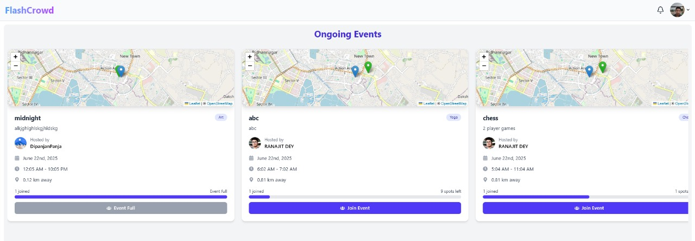
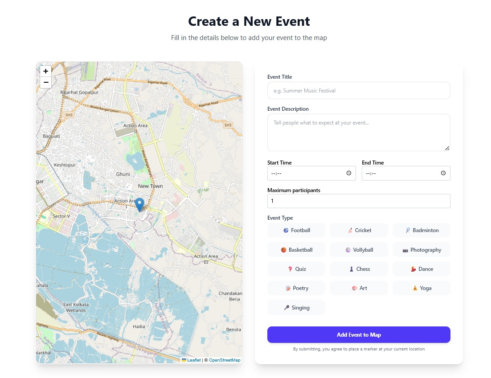
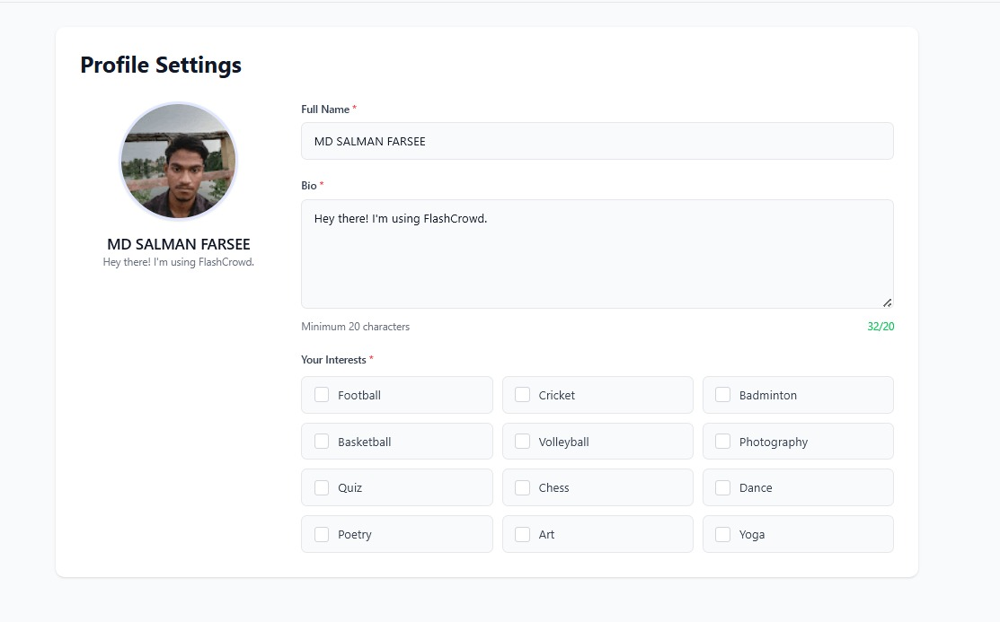

# ⚡ FlashCrowd

**Empowering spontaneous play, anywhere, anytime!**  
[Live Demo 🚀](https://flash-crowd.vercel.app/)

---

## 📌 Objective

**FlashCrowd** is a dynamic web application designed to bridge the gap between people looking for engaging local activities and those organizing them.

In a world where spontaneous plans and social connection are invaluable, **FlashCrowd** empowers users to **host** and **discover play or activity-based events** in real-time, based on their current location.

Whether it's a friendly cricket match at the park, a beach volleyball meetup, or a quick flash mob, **FlashCrowd** makes it effortless to:
- Organize your own events, share location, time, and details with ease.
- Explore **nearby events** using interactive maps.
- Join events instantly and connect with like-minded individuals.
- Navigate using live geolocation and map markers for better reach.

---

## 🌟 Features

- 🗺️ **Live Geolocation Map** — See events happening around you in real-time.
- ✍️ **Add Your Own Event** — Title, description, type, image, and live location.
- 📅 **Event Discovery** — Browse all upcoming and ongoing events.
- 🙋‍♂️ **Join Events** — One click join to express interest.
- 👤 **User Profiles** — View your created events and joined events in one place.
- 💻 **Modern, Responsive UI** — Mobile-first, clean, and interactive design.

---

## 📷 Screenshots

### 🏠 Landing Page

### 📍 Events Page (Nearby Events)

### ➕ Add Event Page

### 👤 Profile Page

---

## 🧑‍💻 Built With

- **React.js** (Frontend Framework)
- **Leaflet.js** (Interactive Maps)
- **Express.js** (Backend API)
- **MongoDB** (Database)
- **Socket.io** (Real-time interactions)
- **Vercel** (Deployment)

---

## 🧑‍🤝‍🧑 Our Team

- **MD SALMAN FARSEE**
- **DIPANJAN PANJA**
- **RANAJIT DEY**
- **RANIT JANA**

Together, we collaborated on the idea, development, and deployment of FlashCrowd to deliver a solution that encourages local interaction, fitness, and fun.

---

## 🌐 Live Deployment

👉 [Visit FlashCrowd Now](https://flash-crowd.vercel.app/)

---

## 📬 Feedback & Contribution

We welcome your feedback!  
Feel free to fork this repository, suggest features, or submit a PR.

---